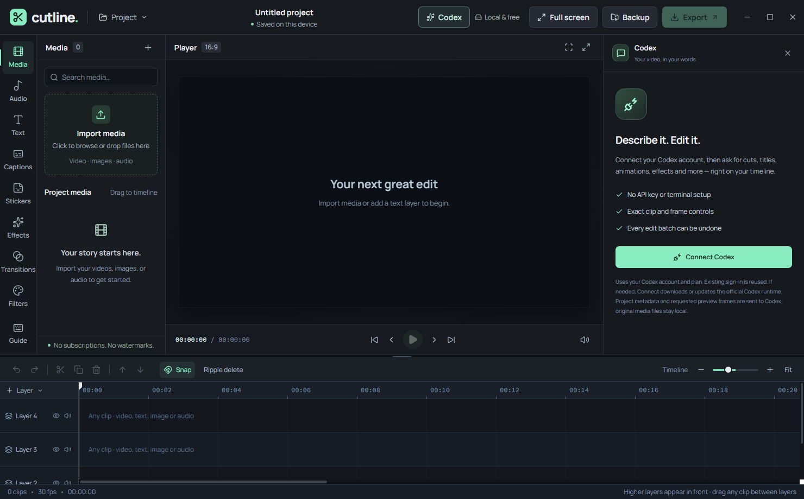
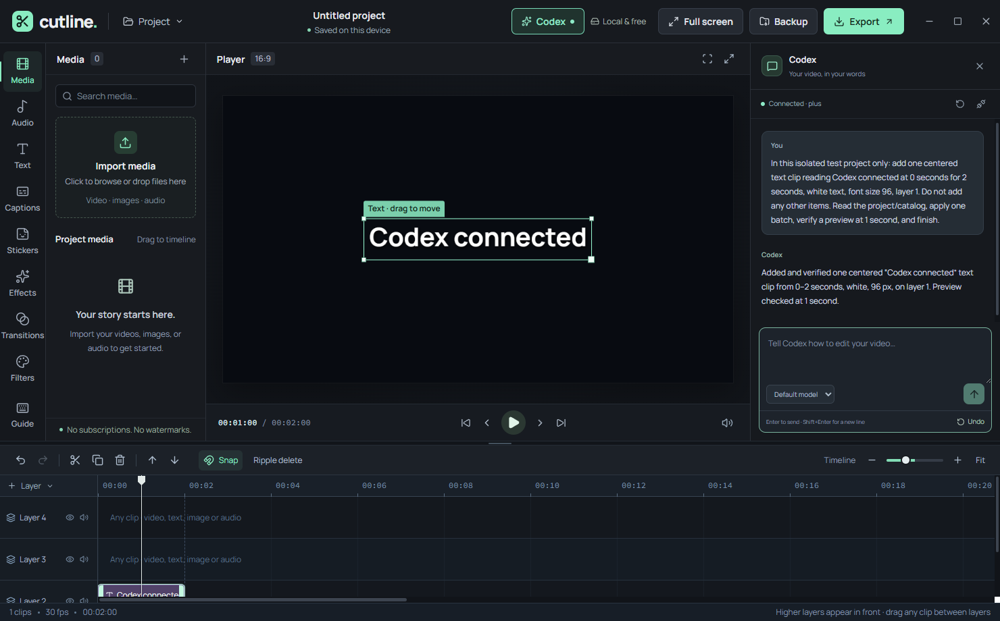

# Cutline 0.4.3

A free, device-local video editor for Windows and the web. Core editing and export require no subscription or account and have no watermark. The optional Codex assistant uses your Codex account and its usage limits. The hosted development site uses its existing private Sites access policy. Original source files stay local; the optional assistant receives project metadata and preview frames it requests.

## Crop video and images

New in 0.4.3: select a video or image clip, then open **Basic → Crop → Crop media**. Move the selection or resize its corners, choose an aspect ratio (including vertical and square), or enter exact source percentages. **Apply crop** commits one undoable edit; Cancel leaves the project unchanged. Reset restores the full source. Cropping is non-destructive, survives project backups and splitting, and uses the same source rectangle in preview and export. Applying a crop switches to Fit inside so the selected region stays visible; Fill frame remains available under Transform.

## Edit your video with Codex (Windows)

New in 0.4.2: video, image and text clips magnetically snap their visible center to the player canvas while dragging. This is on by default. Toggle **Snap to center guides** under a media clip's **Transform** section or a text clip's **Position & timing** section; hold **Alt** while dragging to bypass it temporarily. Live axis guides show the snapped alignment. Active property/motion keyframes are updated correctly, and the drag can be undone or cancelled.

1. Open Cutline and import your media as usual.
2. Click **Codex** in the top bar, then **Connect Codex**. Cutline reuses your sign-in and a supported Codex desktop/CLI installation (0.160.0 or newer). If your installed runtime is missing or outdated, it automatically downloads and verifies a private official Windows x64 runtime, including the required tool host (about 383 MB installed, separate from the editor). Your existing Codex installation is not changed.
3. If prompted, click **Sign in to Codex** and finish the normal browser sign-in. No API key, npm, terminal commands or configuration files are needed.
4. Describe your edit in the panel. For example: “Make a 15-second vertical edit using the imported clips. Add a centered gradient title with Letter Pop In, a slow zoom, and smooth dissolves between the cuts.” Select clips manually when you want to target them. Enter sends; Shift+Enter adds a new line.

Codex works directly on the open timeline. Its editing tools expose exact item IDs, frame-aligned seconds, imported assets, installed fonts, preset names, text styling/gradients, clip transforms/color/audio, animation stacks, Combo loops, effects, genuine two-sided transitions, splits, freeze frames, duplication/deletion, layer mute/hide, and property keyframes. It can inspect rendered preview frames and open the regular export settings. Import and final save location remain under your control.

Each validated batch commits together and undoes in one step. A project/revision check refuses stale edits after manual changes; pending tool calls are cancelled on Stop or Disconnect, and requests for a different open project are rejected. You can keep editing manually, close the panel to return to the inspector, switch models from the account's available list, or start a new chat. Chats are session-only, while timeline edits are autosaved normally. AI can make mistakes: review the result and use Undo or make a backup before a large edit.

The updated model picker discovers GPT-6.1 Sol, GPT-6 Astra, GPT-6 Sol and GPT-6 Luna when returned by your account, with GPT-6.1 Sol as the current runtime default. GPT-5.6 and GPT-5.5 have been removed and are never used as a fallback. Model availability still depends on your account/workspace. After updating Cutline, reconnect Codex to refresh the list and finish the runtime upgrade if prompted. The model list is fully paginated; unavailable models are not fabricated in the picker. GPT-6.1 Sol and GPT-6 Luna each passed a live Windows edit, rendered preview and undo test for this release; Astra and GPT-6 Sol were returned by the signed-in account's catalog but were not separately inference-tested.





The connection uses the official [Codex app-server protocol](https://developers.openai.com/codex/app-server) over a local stdio subprocess, not an editor API key or a remote control port. This ephemeral video-editing session disables shell/environment access, web search and unrelated MCP/app integrations without changing your Codex configuration. Original imported media is not uploaded automatically; project text/settings/metadata and requested rendered preview frames are sent through Codex. This feature is optional and needs internet, an eligible Codex account, and available account usage; Cutline itself remains free. If your existing Codex CLI sign-in uses an API key instead of ChatGPT, its normal API usage charges apply; the composer displays a notice. The browser editor cannot launch this local connection.

## Editing

- Absolute-position universal-layer timeline with frame-aligned moves, cross-track dragging, marquee multi-selection and group moving/deleting, speed-aware trimming, snapping, horizontal/vertical edge scrolling, and adjustable timeline height/zoom.
- Split, duplicate, copy/paste at the playhead, delete, optional ripple delete, grouped undo/redo, and Escape to cancel a drag.
- One canvas renderer shared by preview and export, with local video/image/audio import and independent players for duplicate source clips. Imported audio appears in both Media and Audio; timeline waveforms follow trimmed source ranges.
- 13 adjustable, stackable effects, including animated Wavy distortion with a smooth, scanline-free warp and an adjustable 1–16 wave count on video or text; 12 incoming transitions; 12 color looks; brightness, contrast, saturation, and temperature.
- 14 text presets, 11 built-in offline fonts plus automatically detected Windows fonts, outlines, shadows/glow, backgrounds, spacing, rotation, opacity, and alignment. While dragging text, its visible bounds snap to the canvas center with live axis guides; this is on by default and can be toggled per text clip. The Animation inspector has separate Entrance, Exit, and Combo categories, including Letter Pop In/Out, which animates characters individually. Combo loops (Zoom, Wave, Pulse, Float, Rock, Shake, Heartbeat, Spin, Breathe, and Jelly) stay active across the clip and can be stacked and tuned for intensity and speed on text or video. Refresh the font list after installing a new font. Customizable linear and radial text gradients support up to eight color stops, exact hex colors, stop positions, direction, center, radius, palettes, reversal, and keyframes. Text and visual clips support independently tunable entrance/exit animation stacks: combine Drift, Zoom, Wipe, Fade, and other presets at once, then tune each layer's direction/angle, distance, zoom in or out, rotation, blur, fade, and easing. Name and save an entire stack for reuse. Saved recipes live on each device; applying one copies its settings into the project, including backups.
- Per-property keyframe diamonds for video transform/color/effects/audio and text appearance/effects, plus legacy motion keyframes. Keyframed preview and export share the same renderer.
- Optional, free on-device Whisper Large v3 auto subtitles by default, with multilingual/English Tiny choices (model download starts only when you press Download & transcribe), SRT import, manual captions, editable symbol stickers, zoom-aware audio waveforms with RMS/peak detail, gain, fade-in/out and track mute/hide. Full Large v3 uses q4f16 weights of about 1 GB and requires a WebGPU-capable GPU; model files are from [Hugging Face](https://huggingface.co/onnx-community/whisper-large-v3-ONNX). Models stay cached on your device. Older saved audio waveforms are refreshed from their embedded media. Subtitle errors remain visible in the dialog so they can be retried.
- Autosaved projects with retained project history, portable `.cutline` backups containing imported media, and legacy project migration. The desktop waits for a save before closing.
- Browser-supported MP4/H.264 or WebM/VP9/VP8 export, 720p/1080p/2160p, 30/60 fps, native save dialogs, and immediate cancellation.

Transitions are edited on the incoming clip but span both sides of the cut, animating the outgoing and incoming video together. Duration can be set before choosing a transition style. Dissolve, Zoom, Blur, and Glitch smoothly fade out the outgoing visual even when the incoming image has transparent areas. Embedded video audio crossfades over the same window. Available source handles play through; without handles the edge frame is held. Overlapping video clips on the same track use the later-starting clip; put concurrent layers on separate tracks. Higher-numbered video tracks render above Main. Audio clips may overlap and mix.

Imported stills fit inside the canvas by default; existing stills using the former automatic fill setting are corrected when loaded. A manually selected fill setting is retained. Selection handles follow the visible fitted image, and filled media is cropped to its selection frame.

## Limits

This is not a complete CapCut replacement. Tracking, advanced masking, optical-flow retiming, proxy editing, and GPU/offline render pipelines are not included. Auto subtitles require a first-time model download and may need correction, especially with noisy or overlapping speech. Export is real-time using Canvas, Web Audio and MediaRecorder. Keep the window open and the computer awake. Long edits, 4K/60 fps and stacked effects can consume substantial memory or drop frames; 1080p/30 fps is the practical starting point. Backups larger than 1 GB are rejected. Source codec support depends on the browser/Electron build.

Web projects and PC projects use separate local storage. Transfer edits using a `.cutline` backup. Clearing browser/app data can remove local projects; keep backups of important work. Imported source files themselves are never modified.

The Windows release is unsigned. It is not installed automatically and may trigger a Windows publisher warning.

Whisper Large v3 is the default auto-subtitle model, with Tiny options for CPU-only PCs and smaller downloads. Large v3 uses the full multilingual model with q4f16 weights, downloads about 1 GB once, and requires a WebGPU-capable GPU. Its ONNX export uses segment timestamps because it does not expose the cross-attention needed for word alignment. The Windows production worker was verified transcribing spoken audio with this model. Whisper's ONNX runtime is included in the web and Windows builds, so transcription no longer needs the jsDelivr CDN. Models are downloaded from Hugging Face and cached locally. Subtitle decoding reads imported media directly from project storage; if a source is unavailable, the editor gives a relink/re-import instruction.

## Development

Node.js >=22.13.0 and npm are required.

```sh
npm install
npm run dev
npm run typecheck
npm run lint
npm test
npm run desktop:dist
```

`desktop:dist` emits the Windows x64 installer and portable executable into `outputs/desktop`. Electron uses an isolated, sandboxed preload bridge; Node.js is not exposed to the UI.

`test:unit` runs model/history, isolated React timeline, atomic Codex editing, and mocked app-server protocol tests. `test:engine` tests actual Canvas rendering, IndexedDB preservation, all available encoders, audio, cancellation, duplicate source playback, and the live Editor's Codex tool bridge in an isolated Electron profile. `npm test` also builds and checks the server-rendered shell. Tests never use the user's normal project profile. An optional production integration test, `CUTLINE_LIVE_CODEX=1 electron tests/codex-desktop-live.cjs`, uses the installed Codex sign-in and account usage for one synthetic edit, preview and undo; do not run it as a routine offline test.

## Verification for this release

The model/component/protocol and rendering/export suites cover atomic AI batches, exact IDs, stale revisions, invalid operations, preview frames, undo/redo and persistence, plus the existing animation/effect/transition/audio/export features. A real production Windows run reused Codex sign-in, edited an isolated timeline with a requested title, checked a rendered preview, and undid the edit. The automatic official runtime download was checksum-verified; only the main executable and required tool host are retained. Runtime-version gating, paginated model discovery, removed-model rejection and empty catalogs have automated coverage. Type checking and the server-rendered shell are checked during release packaging.

An isolated Windows production run completed Whisper transcription with CDN requests deliberately blocked and a fresh model download. Isolated Electron screenshots and pointer selection were checked with synthetic media. Timeline component tests simulate pointer events and verify exact clip state/position; they are not a substitute for broad human/device testing. 4K/60 fps and long-project performance are not certified.
