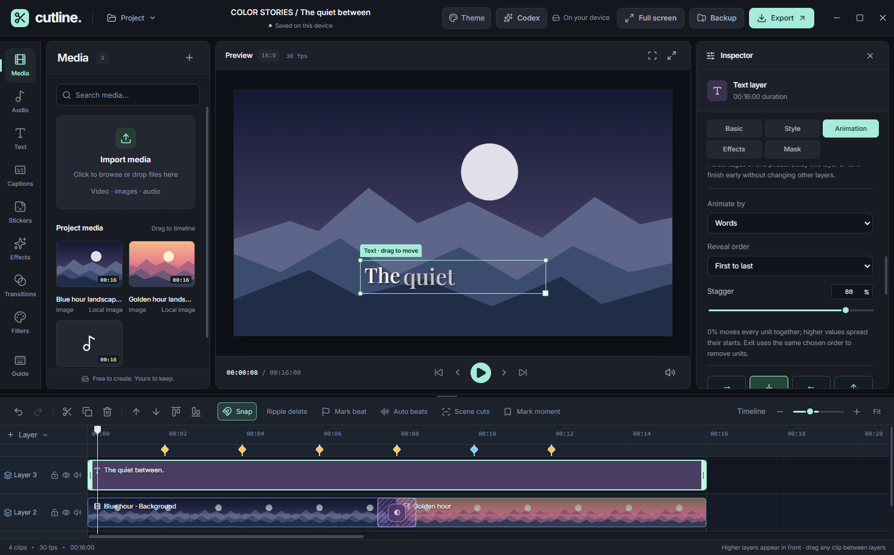
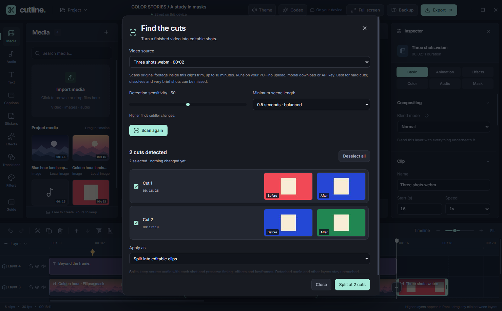
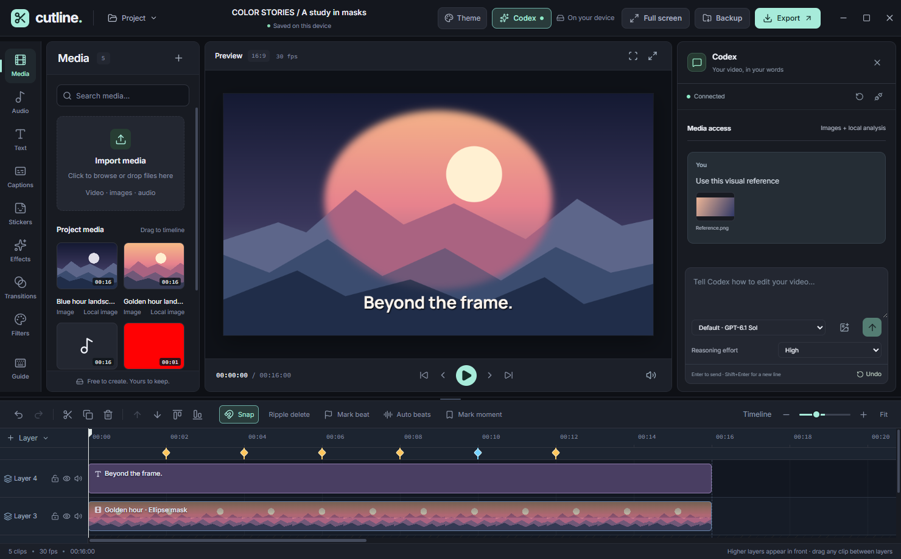
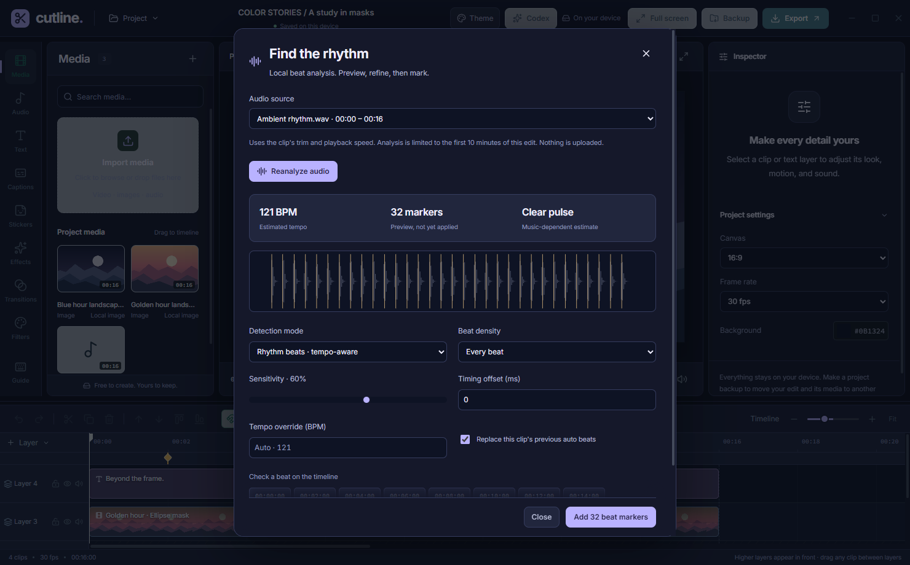
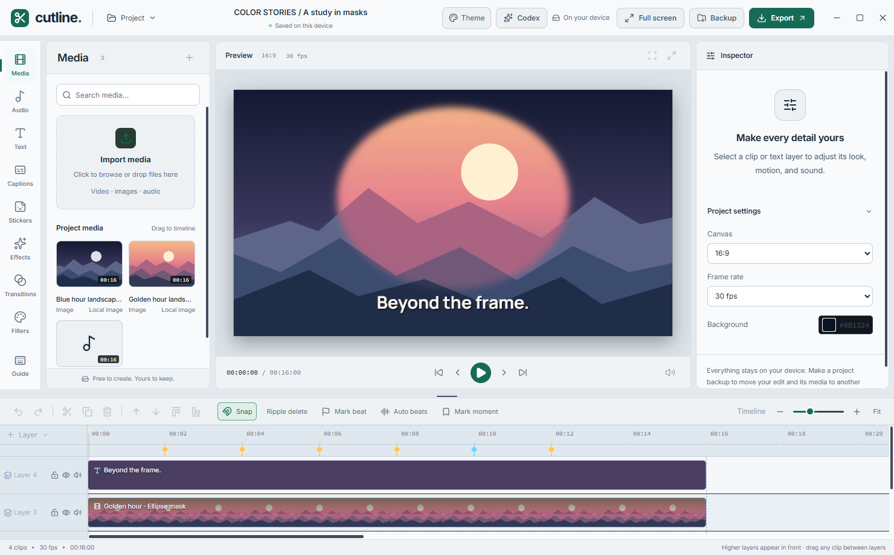
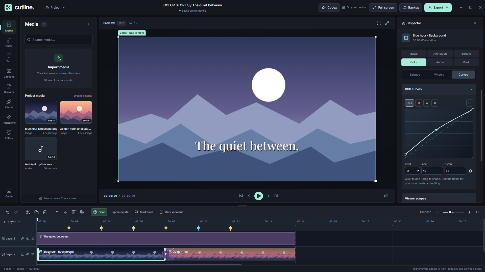
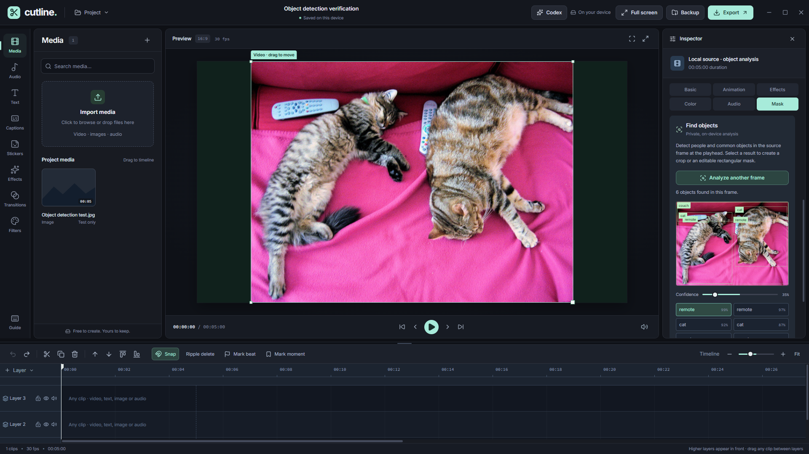
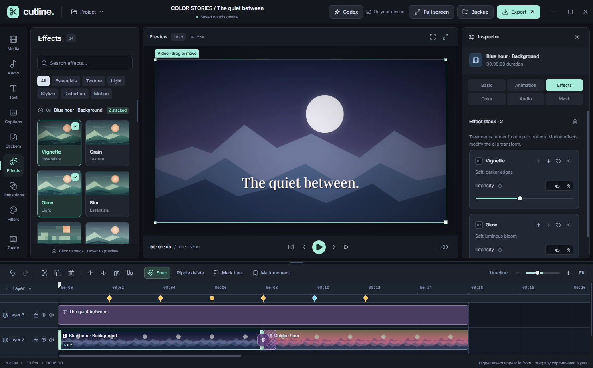
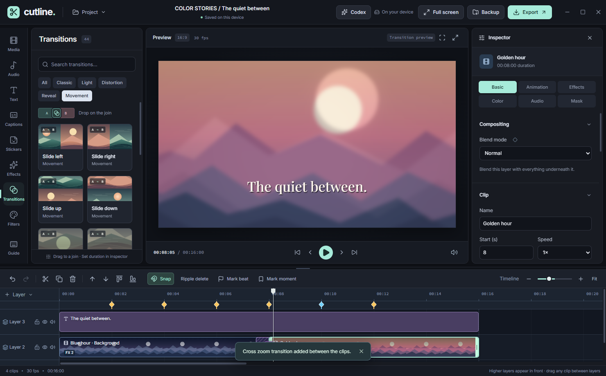
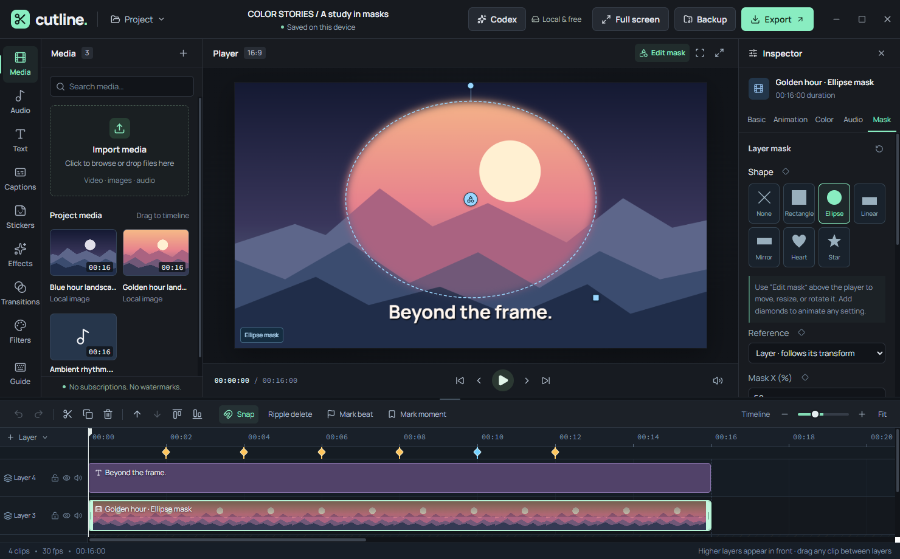

# Cutline 0.8.5

A free, device-local video editor for Windows and the web. Core editing and export require no subscription or account and have no watermark. The optional Codex assistant uses your Codex account and its usage limits. The hosted development site uses its existing private Sites access policy. Original source files and raw audio stay local; the optional assistant receives project metadata, requested images, transcripts and audio-analysis results.

## Disk-backed Windows export (new in 0.8.5)

Windows exports no longer assemble the complete video in RAM or transfer a whole-file buffer through IPC. Click **Export video**, choose a destination, then Cutline writes encoded MP4/WebM data in chunks of at most 1 MiB with acknowledged disk backpressure. This addresses a major long/high-bitrate export reliability limitation without reducing resolution, frame rate or quality. No setting or extra download is needed. The success screen shows the saved path and file size.

The renderer only receives an opaque export session. Native code validates ownership, format, positions and chunk size, writes to an exclusive temporary file beside the chosen destination, flushes it, and replaces the approved destination by same-directory rename only after encoding/frame/size validation succeeds. Cancel, ordinary errors, renderer shutdown and orderly app shutdown clean up the temporary output; existing destinations remain unchanged on failure. Full/locked drives produce actionable errors. Final atomic commit is not cancellable. A forced process kill/power loss can leave a `.cutline-export-*.partial` in the chosen folder; it never becomes the finished video. If cleanup fails, the UI identifies the folder.

MP4 remains a regular, seekable container with metadata at the end, not fragmented MP4. This avoids buffering its media payload but means it is not Fast Start optimized for progressive web playback. WebM remains supported. Browser downloads still use the in-memory path, with a warning; disk-backed export is a Windows feature. Decoded footage, rendering surfaces, codecs and container metadata still use RAM. This is not a proxy-preview feature or a guarantee that arbitrarily large projects, codecs or disks succeed.

Implementation follows [Mediabunny’s streaming-target guidance](https://mediabunny.dev/guide/writing-media-files#streamtarget) and [MP4 memory/layout options](https://mediabunny.dev/guide/output-formats#mp4). Verification includes real streamed files decoded in all three formats, slow-writer backpressure, destination cancellation, overwrite preservation, writer failure, exact 960-frame/60 fps Windows export, session validation, shutdown races and file offsets beyond 4 GiB. The large-offset test is not a multi-gigabyte video encode or a RAM benchmark.

## Frame-accurate export (new in 0.8.4)

Exports now render every frame at an explicit timestamp with WebCodecs and Mediabunny rather than recording live canvas playback. Slow decoding or heavy effects increase render time instead of skipping timeline frames. Quality-mode encoding uses backpressure, and the exporter checks the encoded frame count and timestamps before returning a file. MP4/H.264 and WebM/VP9/VP8 use a constant chosen frame rate, with at most one frame of padding for an edit that ends between frames. No real-time fallback silently degrades the result.

Original video frames are decoded independently for each clip, including trimmed, sped-up, frozen and transition source positions. Audio is decoded and mixed in bounded windows on the same timeline, preserving layers, mute, volume automation, fades, stereo pan and two-sided transition crossfades. Basic waveform-similarity tempo processing preserves pitch for speed changes; extreme retiming can still produce audio artifacts. Silent and sub-second edits no longer rely on a live recorder starting in time. Unsupported input/output codecs produce an error rather than missing frames or silently lost audio.

This removes render-load-induced frame dropping, not every possible cause of choppy playback. Low-frame-rate or already-stuttering source footage is not repaired; there is no optical-flow frame interpolation. Playing demanding 4K/60 fps files still requires a capable player/device. Keep the app open and the PC awake until export finishes. Browser downloads assemble encoded files in memory; Windows 0.8.5 writes output to disk as described above.

Verification: 93 unit/component checks, 15 font/Codex protocol checks and the full 89-check render/export suite pass, plus type checking, scoped lint and server rendering. Stress checks deliberately stall rendering and inspect output packet counts/timestamps at 30/60 fps. An isolated production Windows UI export from the packaged app produced exactly 960 frames at 60 fps over 16 seconds, with audio, native saving and working Cancel. Packaged deletion/Undo/project-reset checks also pass. This does not certify every device, source codec, long project or 4K performance.

## Media and project deletion (new in 0.8.4)

Use the trash button on a card in **Media** or **Audio** to remove it from the current project. Confirmation shows how many timeline clips use it; deleting removes those clips and their automatic guides in one undoable edit. Unlock any affected layers first. Undo restores the media and clips, including after autosave. Other projects and original files on your PC are untouched.

Open **Project → My projects** and use a project's trash button to permanently delete that saved project. Save a backup first if needed: project deletion cannot be undone. Deleting the open project starts a fresh workspace. Only imported media copies no remaining saved project uses are reclaimed; shared media, original files and exported videos are kept. Autosave cannot recreate a deleted project.

## Customizable text sequences (new in 0.8.3)

Select a text clip → **Animation**. Eight new presets join Letter Pop In and Typewriter: **Letter Fade, Letter Slide, Letter Blur, Letter Spin, Letter Bounce, Letter Flip, Word Pop and Line Slide**. They work on both entrance and exit and stack with each other, whole-clip animations, Combo loops and effects. Search the preset grid to find a treatment quickly.

Choose **letters, words or lines**, then reveal forward, reverse, center-out, edges-in or in a reproducible shuffled order. Adjust stagger, movement angle/distance, pop overshoot, flip axis, zoom direction, spin, blur, fade and easing where applicable. Back and Spring easing add more expressive motion. Each stacked layer has its own **start delay and active span**, measured as a percentage of that phase's total duration. Exit ordering follows the same chosen order rather than silently reversing it. Reset affects only the selected layer.

Save the complete stack as a custom preset, including all new controls; settings survive project backups, splitting and validated Codex edits. New letter/word/line presets are text-only, so video clips do not show inapplicable controls. Full-title alignment stays stable while typing/revealing, and grapheme segmentation keeps emoji and combining accents together. Very long titles batch adjacent units to bound animation work; preview/export still depend on your device, font and project complexity.



## Scene-cut detection (new in 0.8.2)

Inspired by [CapCut Split scene](https://www.capcut.com/tools/cut-scene) and [Premiere Scene Edit Detection](https://helpx.adobe.com/uk/premiere/desktop/edit-projects/change-clip-sequence/detect-edit-points-using-scene-edit-detection.html): click **Scene cuts** in the timeline toolbar, or right-click a video clip → **Detect scene cuts**. Select a video, tune sensitivity and minimum scene length, then scan locally. Before/after thumbnails let you audition each proposed boundary and exclude false positives. Apply as **editable clips** or **moment markers only**; either action is one undoable batch. Markers are normal timeline moments readable by Codex.

The lightweight detector compares low-resolution source-frame colors and spatial changes, suppresses isolated flashes, and refines boundaries to project-frame timing. It honors source trim and speed, ignores overlays/effects, preserves source-linked audio and existing keyframe timing when splitting, respects layer locks, and refuses stale results after edits/relinking. Detached audio and other layers remain untouched. Nothing is uploaded; no ML model or API key is needed. Scans are limited to 10-minute clips and 300 candidate cuts. This targets hard cuts, **not semantic scene understanding or dissolve detection**; very short shots can be missed. Review estimates before applying.



## Codex reasoning, image access and free local audio analysis

New in 0.8.1: the Codex composer includes **Reasoning effort**. Choose Auto (the selected model's advertised default) or a supported level. Options come from the signed-in account's model catalog, not a hard-coded list, and apply to each new turn, including an existing chat. Unsupported levels fall back to Auto when switching models. Higher effort can take longer and use more account usage; it does not enable shell access or unrelated tools.

Use the image-attachment button for up to **three visual references** per message. Imported reference files stay outside the timeline unless you separately import them into Media. Local images under 25 MB are downsampled to at most 1024 px, preserving aspect ratio. Codex can request original imported image/video frames with `cutline_view_source` or the edited composite with `cutline_preview`; source video requests use original-file seconds, not timeline seconds. Media text is treated as untrusted content, not instructions.

Expand **Media access** in the chat to control images and local analysis. Images/rhythm are enabled initially and can be disabled immediately. **Local Whisper speech analysis is off until you enable it**, authorizing a one-time model download when the assistant first requests speech. Tiny multilingual and English models work on CPU (~50–100 MB); Large v3 (~1 GB) uses the existing quantized WebGPU path and needs a compatible GPU. No paid audio provider or additional API key is needed. The Codex assistant itself still uses your account/plan.

`cutline_analyze_audio` measures a selected audio/video clip in bounded **0.25–120 second windows**. Rhythm mode reports estimated BPM/confidence, onsets/beats, RMS/peak levels, clipping and silence intervals; no model download is needed. Speech mode runs Whisper locally and returns a transcript with timing. Offset is measured inside the trimmed, speed-adjusted clip; results include window, original-source and timeline seconds. Analysis is of the source before volume/fades/effects/mixing, not the final soundtrack. The tool does not automatically add captions or beat markers or modify the project. Cancellation, disconnect, project changes and permission revocation stop local workers; stale results are rejected.

This is **speech/rhythm analysis, not native audio hearing**. The current Codex connection's models advertise text/image inputs, not raw audio. No raw audio is sent to Codex. Requested downsampled images, reference images, transcripts and timing/level statistics are shared through your account. Recognition and beat detection can make mistakes; they do not establish instruments, sound effects, speaker identity or music mood. Analysis requires readable audio in a browser-supported source format; reimport/re-encode unsupported media if decoding fails.



## Automatic beat detection and workspace themes

New in 0.8.0: **Auto beats** beside Mark beat opens local audio analysis. Choose an audio/video clip, then **Detect beats**. Spectral-flux onset analysis, autocorrelation tempo estimation and tempo-constrained beat tracking run in a cancellable worker—no AI subscription, model download or media upload. The selected source trim and playback speed are respected. Analysis covers the first 10 minutes of the selected edit.

Preview the waveform/markers before applying them. Choose tempo-aware **Rhythm beats** or transient-based **Strong hits**, adjust sensitivity, use a BPM override, choose every/other/fourth/half-beat density, and offset timing in milliseconds. Half-beats are interpolated subdivisions, not separately detected transients. A confidence indicator encourages reviewing uncertain results. Rhythm interpretation varies by music; half/double-time ambiguities and sparse/non-percussive recordings can need manual correction.

Adding markers is one undoable operation, aligned to project frames. Manual beats/moments and other clips' auto guides are preserved. By default, reanalysis replaces only that source clip's auto guides; uncheck the replacement option to merge. Markers can still be clicked, removed, and used for snapping. Project backups and Codex snapshots preserve each auto guide's source clip and estimated BPM. Guides are absolute timeline positions: reanalyze after moving, trimming or changing the source speed. Detection does not automatically cut or animate video.

**Theme** in the topbar changes the entire workspace, including the custom Windows topbar, inspector, panels, menus and timeline. Choose **Graphite**, **Midnight**, **Forest**, or **Light**. The preference persists on this device, independently of projects. Theme changes do not recolor canvas pixels, source footage, color-wheel hues or exported video.

This release also includes the 0.7.1 font fix: selected text fonts are explicitly loaded before preview/export, paused frames redraw after loading, and non-Latin font subsets and font-style keyframes are prepared. The Manrope label now matches the rendered font rather than a cached fallback.





## Advanced color grading and local object detection

New in 0.7.0: select an image/video clip and open **Color**. Balance, Wheels and Curves pages keep the tools focused. Exposure in stops, tint, highlights, shadows, whites, blacks, vibrance and hue join the existing brightness, contrast, saturation and temperature controls. Three tonal color wheels have precise hue, strength and luminance controls. Master/R/G/B curves support up to 12 draggable points, smooth shape-preserving interpolation, numeric editing and channel reset. Viewer scopes show luma or RGB histograms of the full composite. **Apply color grade** bypasses the color look and all grading controls without discarding the settings. Reset clears only color settings and their automation; scalar controls have keyframe diamonds and remain available to Codex in validated units. Curves are clip-wide, not keyframed.

Color grading uses the same full-resolution GPU pass (or CPU fallback) in preview and export, retains alpha, and runs after chroma key and before effects. It is **display-referred, 8-bit sRGB/Rec.709**, not scene-linear HDR/RAW grading. Existing neutral projects retain their appearance.

**Mask → Find objects → Detect objects** analyzes the selected source frame at the playhead, not a screenshot of all layers. The first run asks before downloading the free [YOLOS Tiny detector](https://huggingface.co/Xenova/yolos-tiny), using roughly 10 MB of quantized weights. Its [base model is Apache-2.0 licensed](https://huggingface.co/hustvl/yolos-tiny). No account/API key/payment or footage upload is required. Model files are cached on the device; a fresh worker can reuse them offline. Inference runs in a lazily loaded worker, with cancel/retry, clear error messages, confidence filtering and duplicate suppression. It detects familiar COCO object classes, not arbitrary objects or faces/identities.

Select an outlined object, then **Mask object** or **Crop to object**. A mask is an editable feathered rectangle that follows the clip's transforms; it replaces the existing mask and its keyframes. Cropping is non-destructive and switches to Fit inside. Each action is undoable, respects locked layers and uses normal clip settings in preview/export. Results are frame-specific: this is **bounding-box detection, not pixel-perfect subject cutout or motion tracking**. Changing/relinking the source invalidates stale results.

Fixed the chroma-key enabling bug: switch labels now explicitly target their checkbox rather than the embedded keyframe button. The fix covers the editor's other shared toggle controls too. Real switch-click → saved state → rendered key removal → undo is regression-tested.





## Studio workspace and expanded library

New in 0.7.0: a cohesive graphite/slate workspace with individually framed panels, a wider inspector, more readable labels, roomier controls and a calmer timeline. Neutral surfaces preserve color judgment; mint identifies selection and primary actions. Compact preset cards show category labels, with full descriptions available through their tooltip and accessible name. Inspector sections remain visible in a readable two-row navigation instead of squeezing six labels into one row. Offline Inter typography, keyboard focus indicators and reduced-motion support work without an account or font download.

This release also includes the previously unreleased 0.6.0 library expansion: categorized search and real rendered thumbnails rather than symbolic approximations. Hover or focus a visible card for a live preview; only one card animates at a time, offscreen cards release their rendering resources, and reduced-motion preferences disable animated previews. Catalogue scenes never enter your project or media library.

The library now includes **34 effects** and **44 transitions**, plus None. New effects include optical blur treatments, tilt shift, film dust/scratches, light leaks, posterize, negative, solarize, halftone, edge glow, sketch, fisheye, swirl, ripple, kaleidoscope and mirror. New transitions include four-way/diagonal wipes, vertical pushes, cross zoom, reverse zoom, clockwise/counterclockwise spins and sweeps, flips, whip pans, heart/star/diamond irises, splits, blinds, checkerboard, diagonal stripes and shutter reveals. Both sides of a cut use the same transition path in preview and export, with exact source endpoints.

Black/white dips are restricted to the two clips' alpha footprint, preserving lower layers outside masks. On-canvas transform/mask handles pause while their clip is inside a transition window; move the playhead outside the transition to edit its base position or mask accurately.

Select a visual clip and open **Effects** in the inspector to adjust its ordered stack. Move a treatment earlier/later, reset it, or remove it; intensity remains keyframeable. Removing/resetting an effect clears its obsolete intensity automation. **Strobe** is an explicit flashing treatment (8 Hz); its catalogue preview stays static, and the inspector warns about photosensitivity. Raster remaps/edge treatments bound their processing surface to a 1024-pixel longest edge to contain cost; stacked effects and high-resolution export still need device-specific performance testing.





## Masks and compositing

New in 0.5.0: select a video, image, or text layer and open **Mask**. Choose Rectangle, Ellipse, Linear, Mirror, Heart, or Star. Adjust its position, size, rotation, feather, and inversion; use **Edit mask** above the player to drag its center, size, or rotation handles. Hold Shift while rotating to snap to 15° increments. Layer-relative masks follow the layer's transform and animation; canvas-relative masks stay fixed in the output frame. Diamonds keyframe each setting, and Reset clears the mask and its keyframes. Mask drags commit as one undo step; Escape cancels. Masks are non-destructive and remain consistent through transitions, splitting, project backups, preview and export.

**Basic → Compositing → Blend mode** combines the selected layer with lower layers (Multiply, Screen, Overlay, Difference, and more). **Mask → Chroma key** removes a chosen green/blue-screen or other color with adjustable tolerance, edge softness, and spill suppression. Chroma key uses original media colors before grading; it is not automatic subject recognition or object tracking. All compositing settings are available to the optional Codex assistant in exact, validated units.

## Timeline and audio improvements

New in 0.5.0: lock any timeline layer to protect it from pointer, keyboard, inspector, preset, and AI edits. Unlock it with its padlock button to edit again. Clip menus now include **Detach audio**, preserving source trims, speed, volume, stereo pan, fades, and automation while muting the original video in one undoable edit. Selected groups can align their start or end to the playhead without changing relative offsets. With Snap enabled, dragging and trimming also snap to beat/moment markers; **M** marks a beat, **Shift+M** a moment, and Delete removes a focused marker.

The Audio inspector now includes keyframeable stereo pan and **Normalize peak · −1 dBFS**. Peak normalization measures the imported source and is capped at 200% gain; it is not LUFS loudness matching. Audio waveforms preserve short transients and detached audio uses its source video's waveform when decoding is supported. Media loads are cancelled when removed/replaced, failed loads can retry, export preparation and encoder finalization are cancellable, playback failures are reported, and GPU surfaces are explicitly released when a preview/export is disposed.



## Crop video and images

New in 0.4.3: select a video or image clip, then open **Basic → Crop → Crop media**. Move the selection or resize its corners, choose an aspect ratio (including vertical and square), or enter exact source percentages. **Apply crop** commits one undoable edit; Cancel leaves the project unchanged. Reset restores the full source. Cropping is non-destructive, survives project backups and splitting, and uses the same source rectangle in preview and export. Applying a crop switches to Fit inside so the selected region stays visible; Fill frame remains available under Transform.

## Mark beats and moments

New in 0.4.4: **Mark beat** and **Mark moment** buttons sit beside Snap and Ripple delete on the timeline toolbar. Each click places a marker at the current playhead, aligned to a project frame; clicking the same button again at that time removes it. Markers appear on their own ruler lane. Click a marker to seek there, or right-click it to remove it. They save in project files and backups without changing clip positions, playback, or export duration. When Codex reads the project, it receives each marker's type and time in seconds and uses them as editing timing guides.

## Edit your video with Codex (Windows)

New in 0.4.2: video, image and text clips magnetically snap their visible center to the player canvas while dragging. This is on by default. Toggle **Snap to center guides** under a media clip's **Transform** section or a text clip's **Position & timing** section; hold **Alt** while dragging to bypass it temporarily. Live axis guides show the snapped alignment. Active property/motion keyframes are updated correctly, and the drag can be undone or cancelled.

1. Open Cutline and import your media as usual.
2. Click **Codex** in the top bar, then **Connect Codex**. Cutline reuses your sign-in and a supported Codex desktop/CLI installation (0.160.0 or newer). If your installed runtime is missing or outdated, it automatically downloads and verifies a private official Windows x64 runtime, including the required tool host (about 383 MB installed, separate from the editor). Your existing Codex installation is not changed.
3. If prompted, click **Sign in to Codex** and finish the normal browser sign-in. No API key, npm, terminal commands or configuration files are needed.
4. Describe your edit in the panel. For example: “Make a 15-second vertical edit using the imported clips. Add a centered gradient title with Letter Pop In, a slow zoom, and smooth dissolves between the cuts.” Select clips manually when you want to target them. Enter sends; Shift+Enter adds a new line.

Codex works directly on the open timeline. Its editing tools expose exact item IDs, frame-aligned seconds, imported assets, installed fonts, preset names, text styling/gradients, clip transforms/color/audio, masks, chroma key, blend modes, stereo pan, animation stacks, Combo loops, effects, genuine two-sided transitions, splits, freeze frames, duplication/deletion, layer mute/hide/lock, and property keyframes. It can inspect source images/video frames and rendered preview frames, request permitted local audio analysis, and open the regular export settings. Import and final save location remain under your control.

Each validated batch commits together and undoes in one step. A project/revision check refuses stale edits after manual changes; pending tool calls are cancelled on Stop or Disconnect, and requests for a different open project are rejected. You can keep editing manually, close the panel to return to the inspector, switch models from the account's available list, or start a new chat. Chats are session-only, while timeline edits are autosaved normally. AI can make mistakes: review the result and use Undo or make a backup before a large edit.

The updated model picker discovers GPT-6.1 Sol, GPT-6 Astra, GPT-6 Sol and GPT-6 Luna when returned by your account, with GPT-6.1 Sol as the current runtime default. GPT-5.6 and GPT-5.5 have been removed and are never used as a fallback. Model availability still depends on your account/workspace. After updating Cutline, reconnect Codex to refresh the list and finish the runtime upgrade if prompted. The model list is fully paginated; unavailable models are not fabricated in the picker. Earlier production Windows checks verified a live edit, rendered preview and undo with GPT-6.1 Sol and GPT-6 Luna; Astra and GPT-6 Sol were returned by the signed-in account's catalog but were not separately inference-tested.


The connection uses the official [Codex app-server protocol](https://developers.openai.com/codex/app-server) over a local stdio subprocess, not an editor API key or a remote control port. This ephemeral video-editing session disables shell/environment access, web search and unrelated MCP/app integrations without changing your Codex configuration. Original imported media and raw audio are not uploaded automatically; project text/settings/metadata, requested downsampled source/preview images, attached references and permitted local transcripts/audio statistics are sent through Codex. Disabling media access stops future media requests; it cannot retract information already sent in the chat. This feature is optional and needs internet, an eligible Codex account, and available account usage; Cutline itself remains free. If your existing Codex CLI sign-in uses an API key instead of ChatGPT, its normal API usage charges apply; the composer displays a notice. The browser editor cannot launch this local connection.

## Editing

- Absolute-position universal-layer timeline with frame-aligned moves, cross-track dragging, marquee multi-selection and group moving/deleting, speed-aware trimming, snapping, horizontal/vertical edge scrolling, and adjustable timeline height/zoom.
- Split, duplicate, copy/paste at the playhead, delete, optional ripple delete, grouped undo/redo, and Escape to cancel a drag.
- One canvas renderer shared by preview and export, with local video/image/audio import and independent players for duplicate source clips. Imported audio appears in both Media and Audio; timeline waveforms follow trimmed source ranges.
- 34 adjustable, stackable effects, including animated Wavy distortion with a smooth, scanline-free warp and an adjustable 1–16 wave count on video or text; 44 two-sided transitions; 12 color looks; brightness, contrast, saturation, and temperature.
- 14 text presets, 11 built-in offline fonts plus automatically detected Windows fonts, outlines, shadows/glow, backgrounds, spacing, rotation, opacity, and alignment. While dragging text, its visible bounds snap to the canvas center with live axis guides; this is on by default and can be toggled per text clip. The Animation inspector has separate Entrance, Exit, and Combo categories, including Letter Pop In/Out, which animates characters individually. Combo loops (Zoom, Wave, Pulse, Float, Rock, Shake, Heartbeat, Spin, Breathe, and Jelly) stay active across the clip and can be stacked and tuned for intensity and speed on text or video. Refresh the font list after installing a new font. Customizable linear and radial text gradients support up to eight color stops, exact hex colors, stop positions, direction, center, radius, palettes, reversal, and keyframes. Text and visual clips support independently tunable entrance/exit animation stacks: combine Drift, Zoom, Wipe, Fade, and other presets at once, then tune each layer's direction/angle, distance, zoom in or out, rotation, blur, fade, and easing. Name and save an entire stack for reuse. Saved recipes live on each device; applying one copies its settings into the project, including backups.
- Per-property keyframe diamonds for video transform/color/effects/audio and text appearance/effects, plus legacy motion keyframes. Keyframed preview and export share the same renderer.
- Optional, free on-device Whisper Large v3 auto subtitles by default, with multilingual/English Tiny choices (model download starts only when you press Download & transcribe), SRT import, manual captions, editable symbol stickers, zoom-aware audio waveforms with RMS/peak detail, gain, fade-in/out and track mute/hide. Full Large v3 uses q4f16 weights of about 1 GB and requires a WebGPU-capable GPU; model files are from [Hugging Face](https://huggingface.co/onnx-community/whisper-large-v3-ONNX). Models stay cached on your device. Older saved audio waveforms are refreshed from their embedded media. Subtitle errors remain visible in the dialog so they can be retried.
- Autosaved projects with retained project history, portable `.cutline` backups containing imported media, and legacy project migration. The desktop waits for a save before closing.
- Browser-supported MP4/H.264 or WebM/VP9/VP8 export, 720p/1080p/2160p, 30/60 fps, native save dialogs, and immediate cancellation.

Transitions are edited on the incoming clip but span both sides of the cut, animating the outgoing and incoming video together. Duration can be set before choosing a transition style. Dissolve, Zoom, Blur, and Glitch smoothly fade out the outgoing visual even when the incoming image has transparent areas. Embedded video audio crossfades over the same window. Available source handles play through; without handles the edge frame is held. Overlapping video clips on the same track use the later-starting clip; put concurrent layers on separate tracks. Higher-numbered video tracks render above Main. Audio clips may overlap and mix.

Imported stills fit inside the canvas by default; existing stills using the former automatic fill setting are corrected when loaded. A manually selected fill setting is retained. Selection handles follow the visible fitted image, and filled media is cropped to its selection frame.

## Limits

The new offline exporter covers silent sub-second edits with exact frame-count checks; edits ending between output frames are padded by at most one frame.

Whip transitions combined with non-Normal blend modes can have a darker blurred edge at the moving join; use Normal blend mode for the unmodified whip treatment. Smooth crossfade treatments (including Blur and Cross zoom) use separate coverage weighting to avoid that double-alpha edge issue.

This is not a complete CapCut replacement. Pixel-perfect automatic subject cutout/tracking, freehand or Bezier masks, optical-flow retiming, proxy editing, multicam, scene-linear HDR/RAW grading and professional waveform/vectorscope instruments are not included. The object detector finds familiar classes in a single frame and can be inaccurate; verify its bounding box before applying a crop/mask. Auto subtitles require a first-time model download and may need correction, especially with noisy or overlapping speech. Export renders frames offline using Canvas, WebCodecs and Mediabunny; unsupported sources/codecs fail with an error. Keep the app open and the computer awake. Long edits, 4K/60 fps and stacked effects require more render time and memory; 1080p/30 fps is the practical starting point. Output playback performance depends on the player/device and original source cadence. Backups larger than 1 GB are rejected.

Web projects and PC projects use separate local storage. Transfer edits using a `.cutline` backup. Clearing browser/app data can remove local projects; keep backups of important work. Imported source files themselves are never modified.

The Windows release is unsigned. It is not installed automatically and may trigger a Windows publisher warning.

Whisper Large v3 is the default auto-subtitle model, with Tiny options for CPU-only PCs and smaller downloads. Large v3 uses the full multilingual model with q4f16 weights, downloads about 1 GB once, and requires a WebGPU-capable GPU. Its ONNX export uses segment timestamps because it does not expose the cross-attention needed for word alignment. The Windows production worker was verified transcribing spoken audio with this model. Whisper's ONNX runtime is included in the web and Windows builds, so transcription no longer needs the jsDelivr CDN. Models are downloaded from Hugging Face and cached locally. Subtitle decoding reads imported media directly from project storage; if a source is unavailable, the editor gives a relink/re-import instruction.

## Development

Node.js >=22.13.0 and npm are required. The web build was verified on Node 24.19.0 on Windows. On this host, Node 26.5.0 intermittently aborted with a libuv shutdown assertion after completing the web build; the same build and server-render check completed normally on Node 24.19.0. This is a development-tooling issue, not a packaged Windows startup failure.

```sh
npm install
npm run dev
npm run typecheck
npm run lint
npm test
npm run desktop:dist
```

`desktop:dist` emits the Windows x64 installer and portable executable into `outputs/desktop`. Electron uses an isolated, sandboxed preload bridge; Node.js is not exposed to the UI.

`test:unit` runs model/history, isolated React timeline, compositing/coordinate and atomic Codex editing tests, plus mocked app-server protocol tests. `test:engine` tests actual Canvas rendering, mask controls and keyframe drags, blend/transition endpoints, feather boundaries, chroma key, IndexedDB preservation, all available encoders, masked encoded output, stereo audio, cancellation, duplicate source playback, and the live Editor's Codex tool bridge in an isolated Electron profile. `npm test` also builds and checks the server-rendered shell. Tests never use the user's normal project profile. An optional production integration test, `CUTLINE_LIVE_CODEX=1 electron tests/codex-desktop-live.cjs`, uses the installed Codex sign-in and account usage for one synthetic edit, preview and undo; do not run it as a routine offline test.

The 0.8.1 checks add model-supported effort forwarding/default reset, image-input limits and text-only model rejection, measured audio levels, bounded trim/speed/time mappings and strict media tool validation. `electron tests/codex-media-desktop.cjs` runs the real production Windows UI, preload/IPC bridge and local workers with a test-only Codex transport: original image bounds, distinct decoded video frames, reference downsampling and forwarding, rhythmic audio analysis, unchanged project revisions, permission refusal/revocation, stop cancellation and small-window composer geometry. It does not claim AI inference was performed. The real account connection/catalog is separately checked without sending an inference request. For optional real local speech verification, generate a synthetic WAV with `tests/codex-speech-fixture.ps1`, then set `CUTLINE_SPEECH_TEST=1` for the media test; this explicitly downloads/caches free Tiny in the isolated test profile and checks a nonempty timestamped transcript. Large v3 GPU inference is not separately exercised by these checks.

## Verification for this release

For 0.8.5, all 114 unit/component/protocol/native-writer checks, 90 render/export checks and the server-rendered shell pass (205 total), plus type checking and scoped lint. Disk-target tests decode MP4/VP9/VP8 with bounded chunks and slow-writer backpressure; native tests cover seek-back writes, session ownership, overwrite preservation, full-drive errors, final-size failure and shutdown races. Production Windows UI checks verify 960 frames at 60 fps with audio, destination cancellation, mid-export cancellation and simulated writer failure. The large-offset test is not a multi-gigabyte encoded video or a memory benchmark. Browser exports still use RAM, and source/codec memory, long projects and 4K/device compatibility remain uncertified. Earlier live AI and Whisper model checks were not repeated.

For 0.8.4, all 108 unit/component/protocol checks and 89 render/export checks pass, plus the server-rendered shell, type checking and scoped lint. Tests inspect exact encoded frame count/cadence, source trim/speed/duplicate decoding, synchronized audio beats, pitch-preserving speed, short static edits, IndexedDB deletion/shared-media preservation and stale autosave refusal. The packaged Windows app passes a real 16-second 60 fps export with 960 frames, native save and Cancel, plus deletion/Undo/project-reset and small-window layout checks. Earlier live AI and Whisper model checks were not repeated. Long projects, 4K performance and every device/source codec remain uncertified.

For 0.8.3, all 103 unit/component/protocol checks and 81 rendering/export checks pass, plus the server-rendered shell (185 total), type checking and scoped lint. New checks verify all sequence presets on entrance/exit, real pixel changes from customization, Unicode grouping, mixed animation stacks, stable Typewriter bounds, native inspector controls, saved recipes, per-layer reset and actual encoded video. The encoder now allows its asynchronous final canvas capture to reach the recorder before stopping. Production checks exercise the packaged app archive in an isolated profile at 1100×700 and 1480×920; the same harness can verify an installed archive without accessing normal projects. The website retains its desktop/mobile/200%-zoom gallery and download checks. These checks do not certify every device, font, codec or long-project workload; earlier live AI and Whisper model checks were not repeated.

For 0.8.2, all 96 unit/component/protocol checks and 76 render/export checks pass, plus the server-rendered shell check (173 total), type checking and scoped lint. Scene detection is tested on decoded local video with source trim/speed, thumbnail review, marker application, splitting, undo and cancellation; production scene checks also pass against the packaged app archive. The introductory website passes seven-view gallery, keyboard, dialog and FAQ checks at desktop, mobile and 200% zoom with no horizontal overflow or browser console errors. Earlier media/model checks described below were not all repeated for this update. Estimates and device/codec compatibility still require review.

For 0.8.1, all 88 unit/component/protocol checks and 73 render/export checks pass (161 total), plus the server-rendered shell check, type checking and scoped lint. New production media/permission/composer checks and real Tiny speech transcription pass against both the desktop build and packaged app archive. Run real-time export checks without concurrent CPU-heavy builds/transcription; under load, recording duration/frame timing can drift and tests can time out. The assistant cancels its local media workers when user import/export/subtitle work begins. These checks do not certify all devices/codecs or semantic AI accuracy.

The 0.8.0 update passes 155 model/component/protocol and rendering/export checks, including spectral timing at 80/120/160 BPM, silence/steady-tone rejection, beat density/offset/sensitivity, frame-aligned guide migration and atomic undo, plus cold text-font loading. Production Windows checks exercise real audio decoding and the shipped beat worker, marker preservation/undo/cancellation, four distinct topbar/panel palettes, persisted theme reload and minimum-window geometry. The same beat/theme workflow and Manrope inspector-to-render check are repeated against the packaged app archive. Results remain music- and device-dependent; these tests are not a guarantee of perfect detection or flawless editing.

The 0.7.0 model/component/protocol and rendering/export suites cover grading math, neutral migration, alpha, GPU/CPU agreement, curves, keyframes, strict AI properties, chroma switch clicks, detector-result validation and source-coordinate mapping. They also retain the expanded effect/transition catalogue, deterministic rendering, exact transition endpoints, transparent text, stack order/reset/removal and automation, alongside masks, blend modes, canvas drags, locks, audio and atomic AI batches. Actual encoded MP4/WebM, a masked export and a graded export are decoded and checked. An isolated production Windows run performs real YOLOS Tiny inference, applies an undoable object mask, verifies a fresh worker with network blocked, and checks grading UI/curve input at 1100×700, 1480×920 and 1920×1080. Type checking, scoped lint, the server-rendered shell and packaged startup are part of verification. Earlier releases' production Windows runs verified Codex sign-in, an isolated timeline edit, rendered preview and undo, plus the checksum-verified official runtime download. Live account-consuming AI inference is not routinely repeated for UI/rendering updates.

An isolated Windows production run completed Whisper transcription with CDN requests deliberately blocked and a fresh model download. Isolated Electron screenshots and pointer selection were checked with synthetic media. Timeline component tests simulate pointer events and verify exact clip state/position; they are not a substitute for broad human/device testing. 4K/60 fps and long-project performance are not certified.
